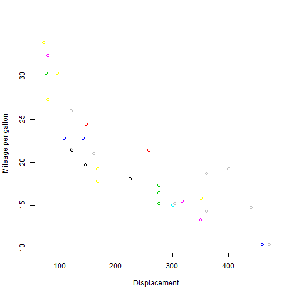

## Shiny and Slidify- Tools to Present Data Products

### Shiny and Slidify work together with R to make data presentation on the worldwide web easy.

--- .class #id 

## Tools at a Glance

Shiny and Slidify make it easy to convert R codes and R markdown documents to present on the Worldwide Web.

* Shiny helps us create simple but interactive web pages that include R codes, their evaulations and HTML document markers in easy way
* Slidify helps us create PowerPoint like presentation with R codes and their evaluation results in very easy way.

--- .class #id 

## Writing and evaluating codes is easy with Slidify


```r
data(mtcars)
head(mtcars)
```

```
##                    mpg cyl disp  hp drat    wt  qsec vs am gear carb
## Mazda RX4         21.0   6  160 110 3.90 2.620 16.46  0  1    4    4
## Mazda RX4 Wag     21.0   6  160 110 3.90 2.875 17.02  0  1    4    4
## Datsun 710        22.8   4  108  93 3.85 2.320 18.61  1  1    4    1
## Hornet 4 Drive    21.4   6  258 110 3.08 3.215 19.44  1  0    3    1
## Hornet Sportabout 18.7   8  360 175 3.15 3.440 17.02  0  0    3    2
## Valiant           18.1   6  225 105 2.76 3.460 20.22  1  0    3    1
```
This slide shows top few records of mtcars dataset.

--- .class #id 

## We Can Plot Graphs Using Slidify


```r
plot(mtcars$disp, mtcars$mpg, col=c(mtcars$disp, mtcars$mpg), 
     xlab = "Displacement", ylab = "Mileage per gallon")
```

 

--- .class #id 

## Thank You!

The purpose of this presentation was to show you basic characterististics of Slidiy and how can it be integregated with R code.
Thank You for viewing my slides


